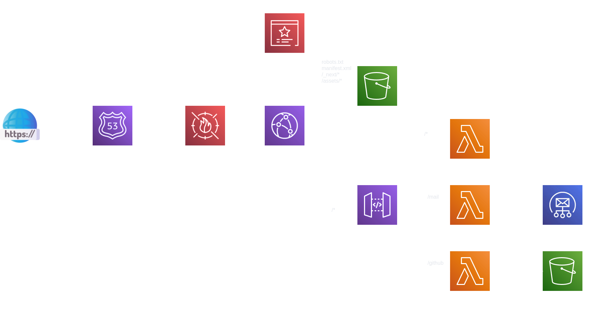

# Personal Website

My personal website visitable at [https://www.manuelenolli.ch](https://www.manuelenolli.ch) 🚀

The base framework is [Next.js](https://nextjs.org/) written in Typescript, additional libraries are:

- [PrimeReact](https://primereact.org/): UI components
- [Tailwind CSS](https://tailwindcss.com/): CSS framework for styling
- [tsparticles](https://particles.js.org/): Particles animation
- [gsap](https://gsap.com/): Animation library
- [AOS](https://michalsnik.github.io/aos/): Animate on scroll library
- [Octokit](https://github.com/octokit): GitHub API client via GraphQL

## Requirements

- node: 20.16.0
- yarn: 1.22.22

## Installation and Usage

```bash
yarn install
```

```bash
yarn dev
```

## Folder Structure

```bash
src/ # All source code
    app/ # pages and components
        layout.tsx # Header and Providers
        page.tsx # Home Page
        error.tsx # Error Page
        components/ # Components
        constants/ # Constants
        context/ # Contexts
        providers/ # Providers
        services/ # Services
public/ # static assets
    assets/ # images, icons, etc.
```

## Deployment

The website is hosted on AWS using the following services:

- [Amazon S3](https://aws.amazon.com/s3/): Static website hosting
- [AWS Lambda](https://aws.amazon.com/lambda/): Serverless functions (Yes, NextJs Server Side Rendering on AWS Lambda 😄)
- [Amazon API Gateway](https://aws.amazon.com/api-gateway/): API management
- [Amazon CloudFront](https://aws.amazon.com/cloudfront/): Content delivery network
- [Amazon Route 53](https://aws.amazon.com/route53/): Domain name management
- [Amazon Certificate Manager](https://aws.amazon.com/certificate-manager/): SSL certificates
- [Amazon WAF](https://aws.amazon.com/waf/): Web application firewall

The AWS Infrastructure can be seen in the following diagram:


A more detailed explanation of the AWS Infrastructure can be found in the project [PersonalWebsiteAWS](https://github.com/ManueleNolli/PersonalWebsiteAws), where the _Infrastructure as Code_ is implemented using the [AWS CDK](https://aws.amazon.com/cdk/).

In addition, there is an email service to create the "contact me" form that uses AWS SES, more details on [AwsLambdaSimpleEmailService](https://github.com/ManueleNolli/AwsLambdaSimpleEmailService).

For fetching my github repositories I created another service using lambda: [AwsLambdaGithubRepositoriesService](https://github.com/ManueleNolli/AwsLambdaGithubRepositoriesService).

### AWS Infrastructure Costs

This section provides an overview of the estimated costs for hosting a personal website on AWS.

##### Free Tier Resources

| **Service**                            | **Free Tier Limit**                                                                                                                                                | **Sources**                                                        |
| -------------------------------------- | ------------------------------------------------------------------------------------------------------------------------------------------------------------------ | ------------------------------------------------------------------ |
| **CloudFront**                         | 10,000,000 HTTPS requests per month                                                                                                                                | [CloudFront Pricing](https://aws.amazon.com/cloudfront/pricing/)   |
| **API Gateway**                        | First 1,000,000 HTTP API calls per month                                                                                                                           | [API Gateway Pricing](https://aws.amazon.com/api-gateway/pricing/) |
| **Lambda**                             | 1,000,000 free requests per month                                                                                                                                  | [Lambda Pricing](https://aws.amazon.com/lambda/pricing/)           |
| **S3 (Amazon Simple Storage Service)** | 5GB of standard storage, 20,000 GET requests, and 2,000 PUT requests for the first 12 months. For a personal website, the cost would be less than $3.00 per month. | [S3 Pricing](https://aws.amazon.com/s3/pricing/)                   |

#### Additional Resources

Those resources are not included into the project, I configured them manually on AWS console.

| **Service**                        | **Cost**                                        | **Sources**                                                                        |
| ---------------------------------- | ----------------------------------------------- | ---------------------------------------------------------------------------------- |
| **Route 53**                       | $0.50 per month for domain name management      | [Route 53 Pricing](https://aws.amazon.com/route53/pricing/)                        |
| **Budgets**                        | $0.01 per report to monitor costs and usage     | [Budgets Pricing](https://aws.amazon.com/aws-cost-management/aws-budgets/pricing/) |
| **Certificate Manager (SSL)**      | Free SSL certificates for use with AWS services | [Certificate Manager Pricing](https://aws.amazon.com/certificate-manager/pricing/) |
| **WAF (Web Application Firewall)** | $5.00 per month for web security protection     | [WAF Pricing](https://aws.amazon.com/waf/pricing/)                                 |

The total monthly cost for the AWS infrastructure is estimated to be less than **\$5.00** per month (plus **\$5.00** for security), considering the resources used and the free tier limits.

Not bad for a personal website! 🚀

#### Additional Information

- [AWS Free Tier Overview](https://aws.amazon.com/free/)
- [S3 Cost Calculator for Personal Websites](https://calculator.aws/#/createCalculator/S3)

## CI/CD

The CI/CD pipeline is implemented using GitHub Actions, the workflow is defined in the file [main.yml](./.github/workflows/actions.yml).

There are four steps:

1. **Tests**: Run the tests (Never failed a test 😎)
2. **Build**: Build the Next.js application with cache and divide the output into `static`, `dependencies` and `code` files.
3. **Upload**:
   - Upload the `static` files to the S3 bucket.
   - Upload the `dependencies` files to the Lambda Layer.
   - Upload the `code` files to the Lambda function.
4. **Refresh Lambda**: Refresh the Lambda function to apply the changes and delete older layer versions.
